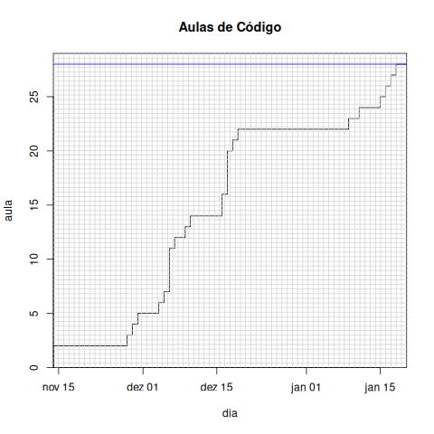

# carta-de-conducao

## Código

<table id="orgc43a3f8" border="2" cellspacing="0" cellpadding="6" rules="groups" frame="hsides">

<colgroup>
<col  class="org-right" />

<col  class="org-right" />
</colgroup>
<thead>
<tr>
<th scope="col" class="org-right">dia</th>
<th scope="col" class="org-right">aula</th>
</tr>
</thead>

<tbody>
<tr>
<td class="org-right">2023-11-14</td>
<td class="org-right">0</td>
</tr>

<tr>
<td class="org-right">2023-11-28</td>
<td class="org-right">2</td>
</tr>

<tr>
<td class="org-right">2023-11-29</td>
<td class="org-right">1</td>
</tr>

<tr>
<td class="org-right">2023-11-30</td>
<td class="org-right">1</td>
</tr>

<tr>
<td class="org-right">2023-12-04</td>
<td class="org-right">1</td>
</tr>

<tr>
<td class="org-right">2023-12-05</td>
<td class="org-right">1</td>
</tr>

<tr>
<td class="org-right">2023-12-06</td>
<td class="org-right">1</td>
</tr>

<tr>
<td class="org-right">2023-12-07</td>
<td class="org-right">4</td>
</tr>

<tr>
<td class="org-right">2023-12-09</td>
<td class="org-right">1</td>
</tr>

<tr>
<td class="org-right">2023-12-10</td>
<td class="org-right">1</td>
</tr>

<tr>
<td class="org-right">2023-12-16</td>
<td class="org-right">1</td>
</tr>

<tr>
<td class="org-right">2023-12-17</td>
<td class="org-right">2</td>
</tr>

<tr>
<td class="org-right">2023-12-18</td>
<td class="org-right">4</td>
</tr>

<tr>
<td class="org-right">2023-12-19</td>
<td class="org-right">1</td>
</tr>

<tr>
<td class="org-right">2024-01-09</td>
<td class="org-right">1</td>
</tr>

<tr>
<td class="org-right">2024-01-11</td>
<td class="org-right">1</td>
</tr>

<tr>
<td class="org-right">2024-01-15</td>
<td class="org-right">1</td>
</tr>

<tr>
<td class="org-right">2024-01-16</td>
<td class="org-right">1</td>
</tr>

<tr>
<td class="org-right">2024-01-17</td>
<td class="org-right">1</td>
</tr>

<tr>
<td class="org-right">2024-01-18</td>
<td class="org-right">1</td>
</tr>

<tr>
<td class="org-right">2024-01-19</td>
<td class="org-right">1</td>
</tr>

<tr>
<td class="org-right">2024-01-20</td>
<td class="org-right">0</td>
</tr>
</tbody>
</table>

    filename <- "data/codigo.csv"
    limite <- 28
    if (!exists("dados")) {
      dados <- read.csv(filename)
    }
    dados <- transform(dados, Ni=cumsum(dados$aula))
    plot(
      dados$Ni,x=as.Date(dados$dia),
      xaxs="i", yaxs="i",
      type="s", ylim=c(0, limite + 1),
      xlab="dia", ylab="aula", main="Aulas de Código"
    )
    grid(nx = as.numeric(difftime(max(dados$dia), min(dados$dia), unit = "days")) + 1, lty=1, lwd=1)
    abline(h=28, col="blue")

<

## Condução

<table id="orga758be9" border="2" cellspacing="0" cellpadding="6" rules="groups" frame="hsides">

<colgroup>
<col  class="org-right" />

<col  class="org-right" />
</colgroup>
<thead>
<tr>
<th scope="col" class="org-right">dia</th>
<th scope="col" class="org-right">aula</th>
</tr>
</thead>

<tbody>
<tr>
<td class="org-right">2023-11-14</td>
<td class="org-right">0</td>
</tr>

<tr>
<td class="org-right">2023-12-12</td>
<td class="org-right">2</td>
</tr>

<tr>
<td class="org-right">2023-12-13</td>
<td class="org-right">1</td>
</tr>

<tr>
<td class="org-right">2023-12-14</td>
<td class="org-right">1</td>
</tr>

<tr>
<td class="org-right">2023-12-15</td>
<td class="org-right">2</td>
</tr>

<tr>
<td class="org-right">2023-12-18</td>
<td class="org-right">2</td>
</tr>

<tr>
<td class="org-right">2023-12-20</td>
<td class="org-right">2</td>
</tr>

<tr>
<td class="org-right">2023-12-21</td>
<td class="org-right">1</td>
</tr>

<tr>
<td class="org-right">2023-12-22</td>
<td class="org-right">1</td>
</tr>

<tr>
<td class="org-right">2024-01-04</td>
<td class="org-right">2</td>
</tr>

<tr>
<td class="org-right">2024-01-09</td>
<td class="org-right">2</td>
</tr>

<tr>
<td class="org-right">2024-03-04</td>
<td class="org-right">2</td>
</tr>

<tr>
<td class="org-right">2024-03-05</td>
<td class="org-right">1</td>
</tr>

<tr>
<td class="org-right">2024-03-07</td>
<td class="org-right">1</td>
</tr>

<tr>
<td class="org-right">2024-03-15</td>
<td class="org-right">2</td>
</tr>

<tr>
<td class="org-right">2024-03-22</td>
<td class="org-right">2</td>
</tr>

<tr>
<td class="org-right">2024-04-08</td>
<td class="org-right">1</td>
</tr>

<tr>
<td class="org-right">2024-04-10</td>
<td class="org-right">1</td>
</tr>

<tr>
<td class="org-right">2024-04-12</td>
<td class="org-right">2</td>
</tr>

<tr>
<td class="org-right">2024-04-13</td>
<td class="org-right">0</td>
</tr>
</tbody>
</table>

    filename <- "data/conducao.csv"
    limite <- 32
    if (!exists("dados")) {
      dados <- read.csv(filename)
    }
    dados <- transform(dados, Ni=cumsum(dados$aula))
    plot(
      dados$Ni,x=as.Date(dados$dia),
      xaxs="i", yaxs="i",
      type="s", ylim=c(0, limite + 1),
      xlab="dia", ylab="aula", main="Aulas de Condução"
    )
    grid(nx = as.numeric(difftime(max(dados$dia), min(dados$dia), unit = "days")) + 1, lty=1, lwd=1)
    abline(h=28, col="blue")

